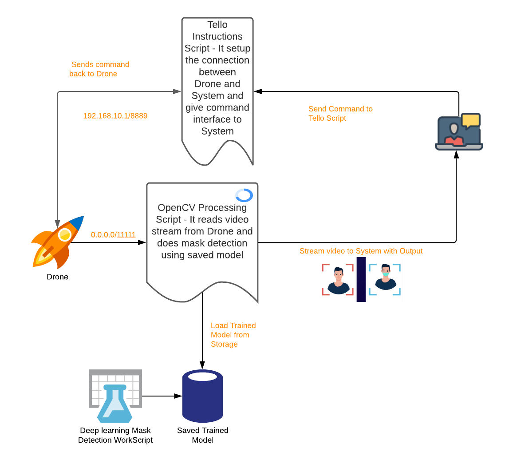
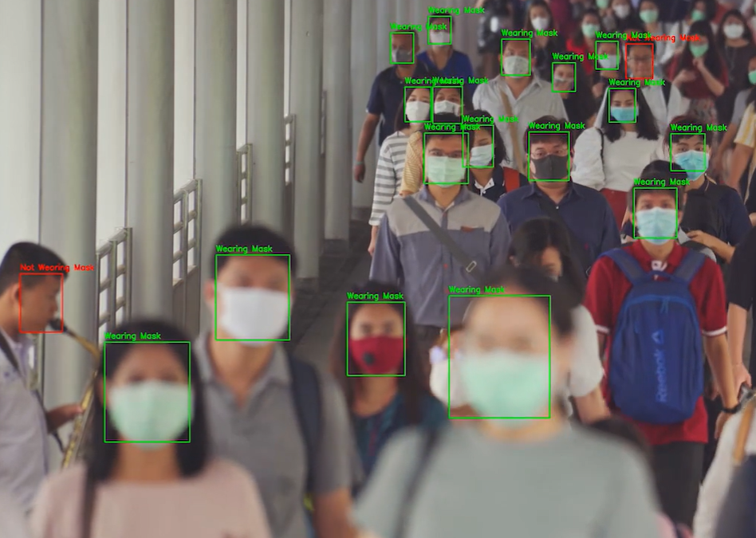
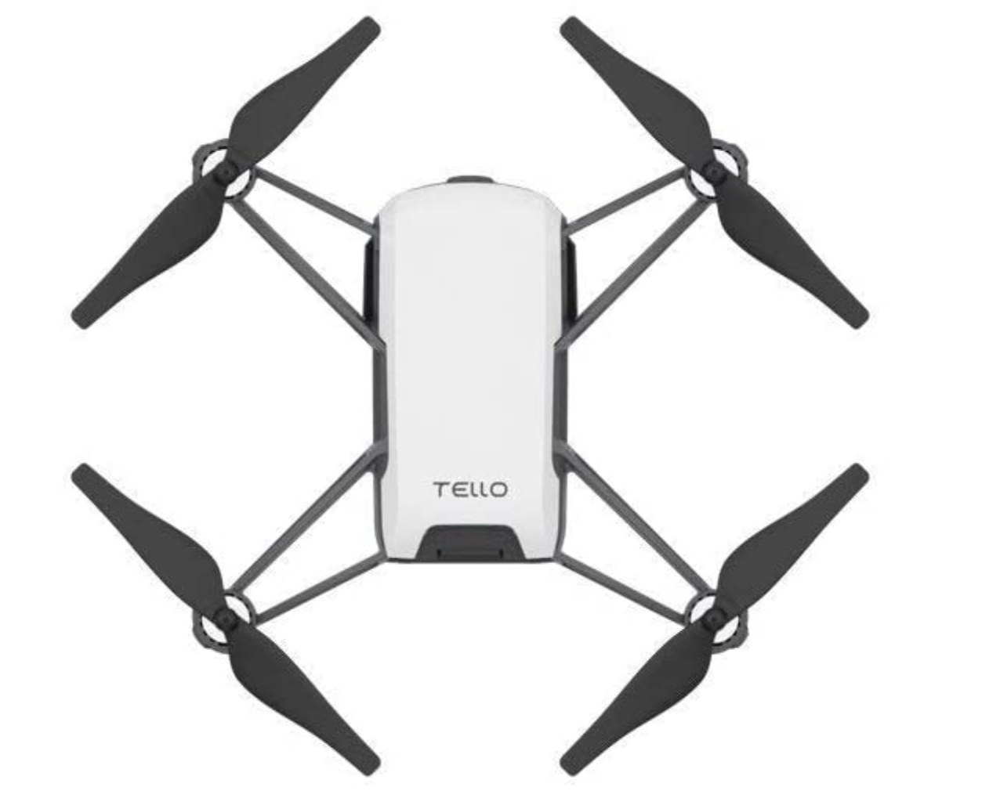

# covid-drone-tracker
The covid drone tacker app uses drone to stream video and detect who is wearing mask and who is not. The idea is to collect data.

Since the vaccine for COVID-19 has been introduced, a lot of people have stopped wearing face masks. While the vaccine is helpful, it is not 100% effective. More importantly, it is important to be courteous of others with compromised immune systems, especially in high-volume areas.

The project here aims to use the surveillance technology such as using Drones ( or Surveillance cameras) to find out who are wearing masks or not in high-density areas. 

### HOW I BUILT IT

The idea is to use Drone camera's live video stream and apply mask detection deep learning algorithm over it to detect if people are wearing masks or not. 

The components and tools of the project are:

1. DJI Tello Drone and SDK
2. Python
3. OpenCV

### Architectur

### Challenges

1. Working with OpenCV: I am new to using OpenCV so it was difficult to learn and use the methods within short time.
2. Training efficient model: Trained the model with small dataset which was open sourced. Did not get time to create my own dataset. So the detection of model is not highly accurate.
3. Streaming video with efficiency: The video with high quality image took long time for decoding and applying model to get result. Thus had to reduce image quality of every frame in video to get smooth experience.
4. M1 Macbook issue: Using Macbook M1 to access GPU costed the time in setting up Deep Learning environment. The ARM64 does not support lot of libraries properly such as tensor flow.
5. Drone: I have a small drone which has a battery life of 15 mins and it is lite in weight, which makes it difficult to test outside room.

### Future Improvements

1. Training model on proper dataset to increase accuracy and detection.
2. Creating SDK so that it can also integrate cameras and other video streaming sources.
3. Deploying the system to Cloud which will help in reducing the network latency, components network communication, secure communication and storage for collecting and analysing data.
4. Use the result from Drone to analyze and take measures in high-volume areas.
5. Expose it as an API.

### Demo Video

coming soon....

### Sources

1. Drone : [DJI Tello](https://www.amazon.com/Quadcopter-DJI-Technology-Processor-Accessories/dp/B07F7PPS1T/ref=sr_1_9?crid=1GVVCGEFIEMD6&dchild=1&keywords=dji+tello&qid=1634274003&sprefix=DJI+te%2Caps%2C184&sr=8-9) 

    

    
2. Pictures and Architecture: [Lucid Chart](https://www.notion.so/9d213590bca34149a63ffe670d964ff2), [Google search result](https://www.biometricupdate.com/202009/covid-19-enhanced-safety-security), [medium](https://medium.com/flutterdevs/face-mask-detection-app-in-flutter-with-tensorflow-lite-89355032ccb6)
3. Dataset and Learning : [Kaggle](https://www.kaggle.com/kripanshubhargava/face-mask-detection)
